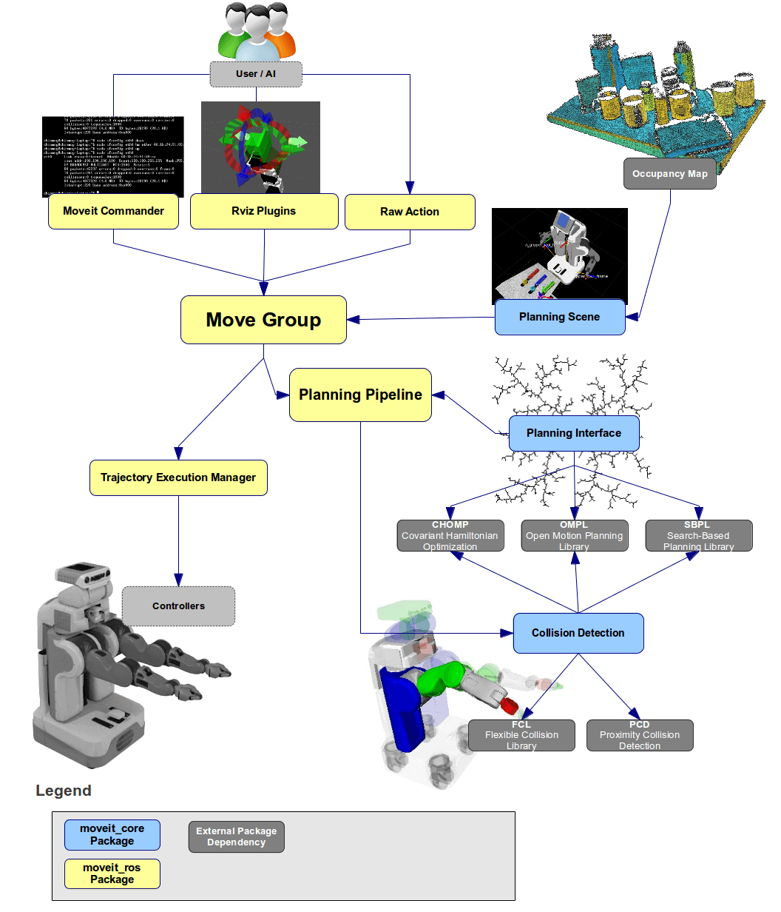
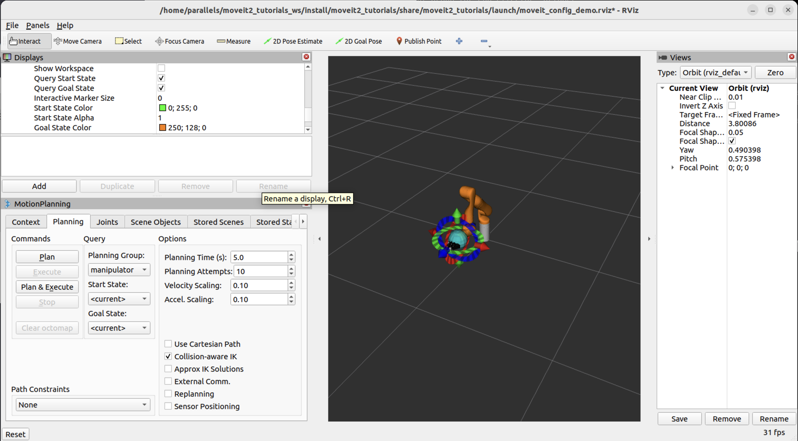

# MoveIt Quickstart Training Guide

## Introduction to MoveIt

MoveIt is a flexible motion planning framework for ROS that enables robots to perform manipulation tasks. This guide will teach you how to:

- Set up and launch MoveIt demonstrations
- Use RViz and the MoveIt Display plugin for motion planning
- Understand robot state visualization
- Interact with robotic manipulators
- Plan and execute collision-free trajectories

By the end of this tutorial, you'll be able to create motion plans visually and understand how motion planning works in real robotics applications.

---

## Key MoveIt Concepts

Before we begin hands-on work, here are the core MoveIt concepts students should understand:

- **Kinematics:** Calculating joint values for a desired end-effector pose (Inverse Kinematics) and computing the resulting pose from joint values (Forward Kinematics).
- **Motion Planning:** Finding a collision-free sequence of joint configurations (a trajectory) that moves the robot from a start to a goal state.
- **Planning Scene / Planning Scene Monitor:** The representation of the robot and its environment (obstacles, attached objects). The Planning Scene Monitor keeps this representation up to date.
- **`move_group` node:** The central MoveIt component that exposes planning, execution, and scene services and coordinates planners, kinematics, and controllers.
- **Collision Checking:** Checking candidate robot configurations or trajectories against the planning scene to ensure no self-collisions or collisions with obstacles.
- **Trajectory Processing:** Post-processing planned trajectories (smoothing, time parameterization, scaling) before execution.
- **MoveIt Task Constructor:** A framework for composing higher-level tasks (e.g., pick-and-place) as sequences of smaller planning and manipulation steps.
- **Hybrid Planning:** Combining different planning modalities (e.g., Cartesian + joint-space) to satisfy constraints like straight-line end-effector motion.

These concepts will appear throughout the exercises. Refer below architecture diagram.


---

## MoveIt Setup Assistant Deep Dive (full lab)

These two days focus on creating a `moveit_config` for a custom robot using the MoveIt Setup Assistant. The material is based on the Setup Assistant tutorial and expanded with lab exercises.

Core learning objectives:
- Import and validate a URDF in the Setup Assistant
- Define kinematic groups, end effectors, and planning groups
- Configure virtual joints, passive joints, and joint limits
- Generate the self-collision matrix and fine-tune it
- Export a `moveit_config` package and integrate controllers and launch files
- Test the generated config in RViz and iterate

Suggested Day 2 schedule:
- 0:00–0:20 — Setup Assistant overview and prerequisites (URDF, meshes, ROS params)
- 0:20–0:60 — Walk through URDF import, fixed/virtual joints, and groups
- 0:60–1:20 — Configure end effector, planning groups, and kinematics plugins
- 1:20–1:50 — Generate and inspect `moveit_config` (SRDF, launch files)
- 1:50–2:00 — Quick test in RViz

Suggested Day 3 schedule:
- 0:00–0:30 — Controllers, ros_control / ros2_control integration notes
- 0:30–1:00 — Self-collision matrix generation, sensors and planning scene updates
- 1:00–1:30 — Hands-on: adjust SRDF, add/modify collision geometry
- 1:30–2:00 — Final testing, debugging, and deploying to real robot (discussion)

Practical notes and link:
- The official Setup Assistant tutorial is a great step-by-step reference: https://docs.ros.org/en/kinetic/api/moveit_tutorials/html/doc/setup_assistant/setup_assistant_tutorial.html
- For MoveIt2 / ROS2 users, the same steps apply conceptually — use the MoveIt Setup Assistant packaged for your ROS distro and export a `moveit_config` compatible with MoveIt2.

Hands-on lab deliverable (end of Day 3):
- A generated `moveit_config` package in the student's workspace that can be launched to visualize the robot in RViz and run simple plans.

---

## Setup Assistant — 12-step practical walkthrough (detailed)

Below is a teacher-friendly, step-by-step paraphrase of the MoveIt Setup Assistant workflow. Each step includes the goal, commands or UI actions, teaching points, and suggested in-class exercises or checks.

Prerequisite command (run on instructor machine or ask students to run beforehand):

```bash
# Launch the MoveIt Setup Assistant (ROS1 example)
roslaunch moveit_setup_assistant setup_assistant.launch
```


---

## Step 1: Launch the Demo and Configure the Plugin

### 1.1 Starting the MoveIt Demo

Launch the MoveIt demonstration with the Kinova Gen 3 robot:

```bash
ros2 launch moveit2_tutorials demo.launch.py
```

This command starts:
- RViz visualization environment
- A simulated Kinova Gen 3 robot
- MoveIt motion planning services

### 1.2 Configuring the Motion Planning Plugin

On your first run, you may see an empty RViz window. 


*Empty RViz window — use the **Add** button in the Displays panel to add the MotionPlanning plugin.*

Follow these steps to add the Motion Planning plugin:

#### Step A: Add the Plugin

1. In the **Displays** panel (left side), click the **Add** button
2. In the dialog, expand the `moveit_ros_visualization` folder

3. Select **MotionPlanning** as the display type
4. Click **OK**

You should now see the Kinova robot arm in RViz.


#### Step B: Configure Basic Settings

1. In the **Global Options** tab, set:
   - **Fixed Frame**: `/base_link`

#### Step C: Configure MotionPlanning Plugin

Click on **MotionPlanning** in the Displays panel and verify these settings:

| Setting | Value |
|---------|-------|
| **Robot Description** | `robot_description` |
| **Planning Scene Topic** | `/monitored_planning_scene` |
| **Trajectory Topic** (under Planned Path) | `/display_planned_path` |
| **Planning Group** | `manipulator` |

The Planning Group dropdown is visible in the MotionPlanning panel at the bottom left of RViz.



**Why these settings matter:**
- **Robot Description**: Tells MoveIt what robot model to use
- **Planning Scene Topic**: Where MoveIt publishes the current robot state and environment
- **Trajectory Topic**: Where planned paths are displayed
- **Planning Group**: Which part of the robot you want to control (in this case, the arm)

---

## Step 2: Understanding Robot Visualizations

RViz displays four different overlapping visualizations of your robot:

### Visualization Types

1. **Scene Robot** (Default: ON)
   - Color: Gray
   - Shows the robot's current configuration in the planning scene
   - Represents the actual state of the robot

2. **Planned Path** (Default: ON)
   - Color: Varied
   - Shows the trajectory the planner calculated
   - Represents all waypoints along the path

3. **Start State** (Default: OFF)
   - Color: Green
   - Shows the starting position for motion planning
   - The pose from which the robot will begin moving

4. **Goal State** (Default: ON)
   - Color: Orange
   - Shows the target position for motion planning
   - The pose where the robot should end up

### Toggling Visualizations

You can toggle each visualization on/off using checkboxes:

| Visualization | Checkbox Location |
|---|---|
| Scene Robot | **Scene Robot** → Show Robot Visual |
| Planned Path | **Planned Path** → Show Robot Visual |
| Start State | **Planning Request** → Query Start State |
| Goal State | **Planning Request** → Query Goal State |

### Exercise: Experiment with Visualizations

Try these steps to understand the different visualizations:

1. Enable all four visualizations by checking all boxes
2. Observe how each visualization appears in different colors
3. Disable the planned path and start state
4. Notice how only the orange goal state and gray scene robot are visible
5. Re-enable visualizations as you need them

---

## Step 3: Interacting with the Kinova Gen 3 Robot

### 3.1 Setting Up for Interaction

To interact with the robot using interactive markers, configure the displays as follows:

1. **Show Robot Visual** (Planned Path): ✓ Checked
2. **Show Robot Visual** (Scene Robot): ☐ Unchecked
3. **Query Goal State** (Planning Request): ✓ Checked
4. **Query Start State** (Planning Request): ✓ Checked

You should now see two interactive markers:
- **Green marker**: Start State
- **Orange marker**: Goal State

If you don't see the markers, click the **Interact** tool in RViz's top menu (you may need to press "+" to show additional tools).

### 3.2 Moving the Robot Interactively

**Dragging the End-Effector:**

1. Click and drag either the green or orange marker
2. The entire arm follows the marker position
3. Observe how the robot's joint configuration changes

**Rotating the End-Effector:**

1. Look for the rotation rings on the marker
2. Click and drag the rings to rotate the end-effector
3. The arm adjusts its joints to maintain the desired orientation

### 3.3 Understanding Collisions

#### Detecting Self-Collisions

Try moving the arm into a configuration where two links collide:

1. Uncheck **Show Robot Visual** (Planned Path)
2. Uncheck **Query Goal State** (Planning Request)
3. Now only the green start state should be visible
4. Drag the green marker to create a self-collision
5. Colliding links will **turn red**

#### What is Self-Collision?

Self-collision occurs when different parts of the robot touch each other. This is physically impossible and the planner must avoid it.

#### Collision-Aware Inverse Kinematics (IK)

The **"Use Collision-Aware IK"** checkbox in the Planning tab controls how the IK solver behaves:

**When Checked (Recommended):**
- The solver actively avoids collisions
- It will find alternative joint configurations that don't collide
- If no collision-free solution exists, no valid configuration is found

**When Unchecked:**
- The solver ignores collisions
- It may produce solutions where links overlap
- Useful for analysis but not for real execution

### Exercise: Collision Exploration

1. Uncheck "Use Collision-Aware IK"
2. Drag the arm to create a self-collision (watch for red links)
3. Check "Use Collision-Aware IK"
4. Try the same motion again
5. Observe how the IK solver finds collision-free alternatives

### 3.4 Workspace Constraints

#### Moving Out of Reachable Workspace

**Workspace** is the region in 3D space that the robot can physically reach.

Try this experiment:

1. Drag the orange goal marker far away from the robot base
2. Try placing it above your head (outside the robot's reach)
3. The marker may turn **red** or the IK solver may fail
4. This indicates the position is unreachable

**Why This Matters:** Not all positions in space are reachable. The number of joints, joint limits, and link lengths determine the robot's workspace.

#### Respecting Joint Limits

The robot has physical joint limits:
- **Revolute joints**: Limited angular range (e.g., -180° to +180°)
- **Prismatic joints**: Limited linear range
- **Collision constraints**: Must not hit itself

The IK solver respects these constraints automatically.

### 3.5 Joint-Level Control

#### Moving Individual Joints

1. Find the **Joints** tab in the MotionPlanning panel
2. Look for sliders for each joint
3. Move individual joint sliders to see how the arm reacts
4. Each joint moves independently

#### Null Space Exploration (7-DOF Robots)

The Kinova Gen 3 has 7 degrees of freedom (DOF), making it **redundant**:

- **6 DOF needed**: To reach any position and orientation in 3D space
- **7 DOF available**: Extra degree of freedom allows null space exploration

**Null Space Movement:**
- The end-effector stays in the same position
- Only the internal arm configuration changes
- Useful for avoiding obstacles without moving the end-effector

Try the **null space exploration slider** in the Joints tab to see this in action!

---

## Step 4: Motion Planning with MoveIt

Motion planning is the process of finding a collision-free path from a start pose to a goal pose.

### 4.1 Basic Motion Planning Workflow

#### Step 1: Set the Start State
1. Drag the **green marker** to your desired start position
2. Ensure no self-collisions exist (red links indicate problems)

#### Step 2: Set the Goal State
1. Drag the **orange marker** to your desired goal position
2. Ensure no self-collisions exist

#### Step 3: Execute the Plan
1. In the **MotionPlanning** panel under the **Planning** tab
2. Click the **Plan** button
3. MoveIt calculates a collision-free path between start and goal

#### Step 4: Visualize the Path
1. Check the **Show Trail** checkbox in **Planned Path**
2. You'll see the arm's path represented as a series of poses
3. Each pose is a waypoint along the trajectory

#### Step 5: Execute the Trajectory
- Click **Execute** to send the path to the robot
- Click **Plan & Execute** to plan and execute in one action

### 4.2 Trajectory Inspection

#### Using the Trajectory Slider

To examine each waypoint of a planned trajectory:

1. From the **Panels** menu, select **Add New Panel**
2. Choose **Trajectory - Trajectory Slider**
3. A slider panel will appear at the bottom of RViz

#### Walkthrough:
1. Set a goal pose using the orange marker
2. Click **Plan** in the MotionPlanning panel
3. In the Trajectory Slider panel:
   - Drag the slider to move through waypoints frame-by-frame
   - Click **Play** to watch the trajectory animate
   - Click **Pause** to stop the animation

**Important:** Always click **Plan** before clicking **Play** if you changed the goal. Otherwise, you'll see the old trajectory.

### 4.3 Planning Methods

#### Free-Space Planning (Default)

The robot can move its joints in any combination to reach the goal:

- **Advantages**: Faster planning, finds clever joint configurations
- **Disadvantages**: End-effector path may be non-intuitive

**How it works:**
1. Move the goal marker
2. Click **Plan**
3. The planner finds joint configurations that reach the goal

#### Cartesian Path Planning

The robot moves its end-effector in a straight line through 3D space:

- **Advantages**: Predictable, linear motion
- **Disadvantages**: Slower, may not always find a solution

**Activating Cartesian Planning:**
1. Find the **"Use Cartesian Path"** checkbox in the Planning tab
2. Check the box
3. Click **Plan**
4. The robot's end-effector will move linearly to the goal

**Comparison Example:**
- **Free-space**: Arm takes a curved path through joint space
- **Cartesian**: Arm's end-effector moves straight through 3D space

### 4.4 Velocity and Acceleration Scaling

#### Why Scaling Matters

By default, trajectories execute at **10% (0.1x) of maximum speed**:

- **Safety**: Prevents sudden movements in simulation or physical robots
- **Testing**: Allows observation of motion without fast movements
- **Reality**: Real robots often move slower than their maximum capability

#### Adjusting Scaling

In the **Planning** tab of the MotionPlanning panel:

1. Find **Velocity Scaling** (default: 0.1)
2. Find **Acceleration Scaling** (default: 0.1)
3. Change these values between 0.0 and 1.0
4. Execute a plan to see the effect

**Recommendations:**
- Start with 0.1 for safe exploration
- Increase gradually as you become comfortable
- For real robots, always start conservative

#### Default Configuration File

These default values are set in `joint_limits.yaml` in your robot's `moveit_config` package. You can modify these defaults if needed.

### 4.5 Motion Planning Execution

#### Plan & Execute in One Step

```
[Plan & Execute] button
```

This performs planning and execution automatically.

#### Two-Step Process

1. **Plan first** to verify the path is collision-free
2. **Execute** only if the plan looks good

**Best Practice:** Use two steps during learning so you can inspect the trajectory before execution.

---

## Advanced Topics

### Enabling RViz Visual Tools

Many MoveIt tutorials use `moveit_visual_tools` for interactive stepping through code:

1. From the **Panels** menu in RViz, select **Add New Panel**
2. Choose **RvizVisualToolsGui**
3. Click **OK**
4. A new panel appears with step-through controls

This is useful when working with C++ or Python MoveIt scripts.

### Saving Your RViz Configuration

After configuring RViz to your preferences, save your setup:

1. Click **File** → **Save Config**
2. Choose a filename and location
3. Next time, launch with your saved config:

```bash
ros2 launch moveit2_tutorials demo.launch.py \
    rviz_config:=your_rviz_config.rviz
```

**Note:** Save the file in `moveit2_tutorials/doc/tutorials/quickstart_in_rviz/launch/` and rebuild your workspace.

---

## Exercise: Complete Motion Planning Task

Now that you understand motion planning, try this complete workflow:

### Task: Plan a Complex Motion

1. **Identify a starting position**
   - Move the green marker to a position with arm extended downward
   - Ensure no self-collisions

2. **Set a goal position**
   - Move the orange marker to a position with arm raised upward
   - Ensure no self-collisions
   - Make sure it's within the workspace

3. **Plan the trajectory**
   - Click **Plan** in the MotionPlanning panel
   - Observe the planned path

4. **Analyze the path**
   - Enable the Trajectory Slider
   - Step through each waypoint
   - Verify the path looks smooth and avoids collisions

5. **Execute the motion**
   - Click **Execute**
   - Watch the simulated robot follow the trajectory

6. **Experiment with different settings**
   - Try with Cartesian path planning
   - Adjust velocity scaling
   - Use null space exploration
   - Try collision-aware vs. non-aware IK

---

## Key Concepts Summary

| Concept | Definition |
|---------|-----------|
| **Motion Planning** | Finding collision-free paths for robots |
| **Start State** | The robot's initial configuration (green) |
| **Goal State** | The target configuration for the robot (orange) |
| **Self-Collision** | When different parts of the robot touch each other |
| **Workspace** | The 3D region the robot can physically reach |
| **Inverse Kinematics (IK)** | Converting desired end-effector pose to joint angles |
| **Trajectory** | A sequence of poses over time |
| **Waypoint** | A single pose along a trajectory path |
| **Null Space** | Extra degrees of freedom beyond 6-DOF |
| **Cartesian Path** | Linear motion in 3D space (end-effector) |
| **Free-Space Planning** | Planning in joint configuration space |
| **Velocity Scaling** | Adjusting speed (0.0 = stop, 1.0 = max speed) |

---

## Troubleshooting

### Problem: Cannot see the robot in RViz

**Solution:**
1. Check that MotionPlanning plugin is added
2. Verify **Fixed Frame** is set to `/base_link`
3. Verify **Robot Description** is `robot_description`
4. Check RViz error messages in the terminal

### Problem: Interactive markers not visible

**Solution:**
1. Make sure you're in **Interact** mode (click the tool in top menu)
2. Verify **Query Start State** and **Query Goal State** are checked
3. Try zooming in/out or resetting the view

### Problem: Planning always fails

**Solution:**
1. Verify the goal is within the robot's workspace
2. Check that goal and start states are not in collision
3. Try moving them slightly to give the planner more room
4. Disable **Use Collision-Aware IK** temporarily to debug

### Problem: Robot moves too fast or too slow

**Solution:**
1. Adjust **Velocity Scaling** and **Acceleration Scaling** in the Planning tab
2. Verify values are between 0.0 and 1.0
3. Save your preferred settings in the RViz configuration

---

## Next Steps

Now that you've mastered visual motion planning, you're ready for:

1. **Your First C++ MoveIt Project**
   - Create command-line programs to control the robot
   - Learn the MoveIt C++ API

2. **Advanced Motion Planning**
   - Plan around obstacles in the environment
   - Use different motion planning algorithms

3. **Pick and Place Operations**
   - Combine motion planning with gripper control
   - Use MoveIt Task Constructor for complex tasks

4. **Real Robot Integration**
   - Deploy motion plans on actual hardware
   - Handle real-world physics and uncertainty

---

## Glossary

**Degrees of Freedom (DOF)**: The number of independent joint motions a robot has. A 6-DOF robot can reach any position and orientation in 3D space.

**End-Effector**: The tool at the end of the robot arm (in this case, where gripper would attach).

**Gripper**: The hand or tool on the end-effector that grasps objects.

**Planner**: An algorithm that computes collision-free paths given start and goal configurations.

**ROS (Robot Operating System)**: A flexible framework for writing robot software.

**RViz (ROS Visualization)**: The primary visualization and debugging tool in ROS.

**Self-Collision**: Undesired contact between different parts of the robot's own structure.

**Kinova Gen 3**: A lightweight collaborative robot arm used in this tutorial.

**Joint Space**: The space of all possible joint configurations (angles for revolute joints, distances for prismatic joints).

**Cartesian Space**: The 3D physical space where the robot operates (x, y, z coordinates).

---

## References

- [Official MoveIt Tutorial](https://moveit.picknik.ai/main/doc/tutorials/quickstart_in_rviz/quickstart_in_rviz_tutorial.html)
- [MoveIt Documentation](https://moveit.picknik.ai/)
- [ROS 2 Documentation](https://docs.ros.org/en/humble/)
- [Kinova Gen 3 Specifications](https://www.kinovarobotics.com/en/products/gen3-robot)

---

**Document Version:** 1.0  
**Last Updated:** 2026-06-03  
**Difficulty Level:** Beginner to Intermediate
